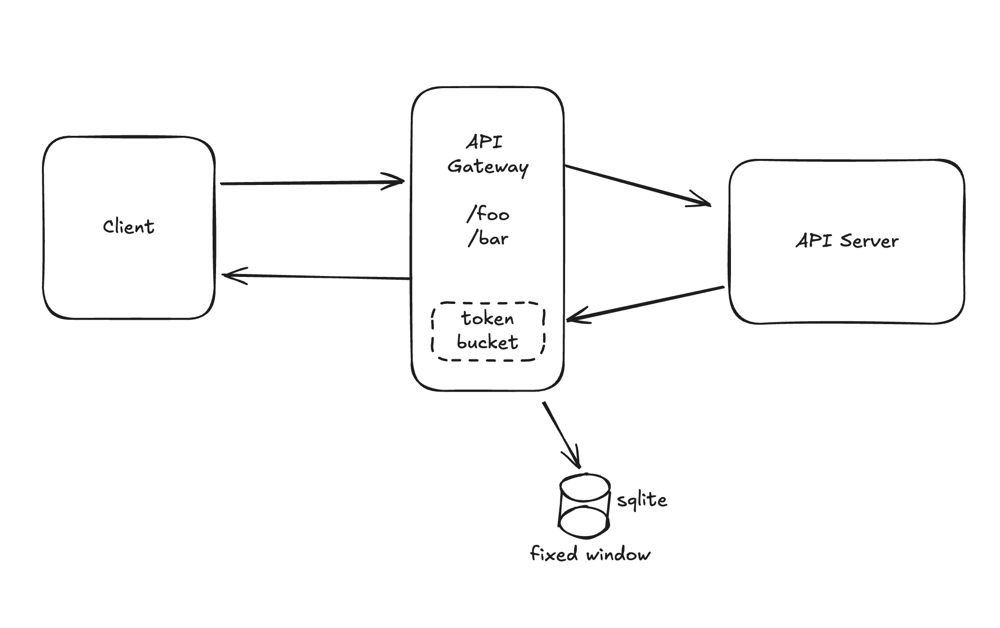

# Showpad Demo — Gateway & API

This is a simple example project that implements an API service and a gateway with rate-limiting. 

**Main pieces:**

- Database migration
  - Simple sqlite migration included to create users and request_count tables.
  - Migration entrypoint: [`gateway/cmd/db-migration/main.go`](gateway/cmd/db-migration/main.go)
  - Run locally: `go run gateway/cmd/db-migration/main.go`
  - It needs to be run one time, before launching the other services.
  - The migration step creates three users:
    ```sh
	
	| Id |  Name  | Quota(req/second) | 
	|----|--------|-------------------|
    | 0  | Admin  |       10.0        |
	|----|--------|-------------------|
	| 1  | Ionel  |        0.5        |
	|----|--------|-------------------|
    | 2  | Ionela |        1.0        |

	```

- Gateway service
  - The main application entry point, that currently only handles rate limiting.
  - Start: `go run ./gateway/cmd/gateway`
  - Main: [`gateway/cmd/gateway/main.go`](gateway/cmd/gateway/main.go)
  - Config: [`gateway/config/gateway.hcl`](gateway/config/gateway.hcl)

- API service
  - The secured API, only accessible via the gateway service
  - Start: `go run ./api/cmd/api`
  - Main: [`api/cmd/api/main.go`](api/cmd/api/main.go)
  - Config: [`api/config/api.hcl`](api/config/api.hcl)

## Architecture
This application is formed of two components:
- **API Gateway**  
  Handles rate limiting using two strategies:
  - Token Bucket strategy (in-memory)
  - Fixed Window strategy (using an SQL table)

- **API Server**  
  The application backend, hidden behind the API gateway
  - Validates authorization and does basically nothing




This implementation has a few advantages:
- The responsiblity is well separated.
- The two components can scale independently.
- The two services can be hosted on different machines.

.. and some drawbacks:
- Latency - there are more hops in a request round-trip, compared to a single-component design.
- More deployment and configuration overhead for two services instead of one.


  
## Getting started (local dev)
1. Ensure Go 1.20+ is installed.
2. Run the DB migration:
   ```sh
   go run gateway/cmd/db-migration/main.go
   ```
   A typical success response looks like 
	```sh
	Migration completed successfully.
   ```
3. Start the API:
   ```sh
   go run api/cmd/api/main.go
   ```
4. Start the gateway:
   ```sh
   go run gateway/cmd/gateway/main.go
   ```

## Usage
- Access the `/foo` and `bar` endpoints with user 0, 1 or 2.
  ```sh
  curl localhost:8080/bar \
	-H 'Authorization: Bearer 1'
  ```
- Repeat the request multiple times with the same user in order to notice API throttling.
- Access the `users/{userId}` with the `PUT` method for updating their rate limit. The endpoint is only accessible by the Admin (with id = 0). The request below updates the rate of user 2 to 0.5 requests/second (one allowed request for every two seconds).
  ```sh
  curl -XPUT localhost:8080/users/2 \
	-H 'Authorization: Bearer 0' \
	-d '{"rate": 0.5}'
  ```
  The endpoint will return a `401` response if accessed by any other user.

## Tests
- Tests can be found in [tests](tests)
- Install dependencies
  ```sh
  cd tests && npm install
  ```
- Run tests
  ```
  npm test
  ```